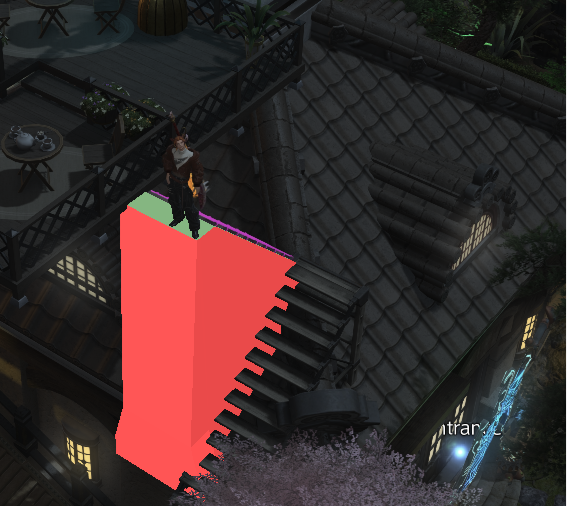

# Housingway
A FFXIV tweak collection plugin for housing. Custom skyboxes, helper tools, and adjustments for all your housing needs!

## Showcase

## Tweaks

Open to view tweaks

### Disable Camera Collision
Allows the camera to clip through *furnishings*.

### Disable Cast Shadows
Disables the shadows casted by different light objects when within housing.
This may help with performance and some disgusting lighting pop-in.

### Disable SSAO
Disables SSAO within housing.

### Display Pop Range
Overlays the area in which you may spawn in.

### Door Command
Adds the /door command to easily return to the entrance of a house, plot, or apartment.

### Furniture Info
Less of a tweak, more of a tool for learning about different furniture.

### Highlight Phased Objects
Highlights objects that have had their player collision disabled.

### Indoor Sun
Enables the Sun when indoors!

### Model Adjustments
Some toggleable adjustments geared towards void builders.
No more house shell or shame cube.

### Override Interior Lighting
Overrides the interior lighting of other player's houses to your desired setting.

### Skybox
Overrides the interior skybox.

## Contributing
Feel free to add your own tweaks. Simply fork, clone, and copy the relevant template from `Housingway/Tweaks/_Templates` into the `Tweaks` folder to get started making your own.
Use any of the other tweaks as reference as needed.

## Credits
* [Ktisis](https://github.com/ktisis-tools/Ktisis) for Skyboxes, Interior Lighting, and Ambient Occlusion tech
* [HaselTweaks](https://github.com/Haselnussbomber/HaselTweaks/tree/main) for some architectural inspiration
* [Pictomancy](https://github.com/sourpuh/ffxiv_pictomancy) for in-world drawing tools
